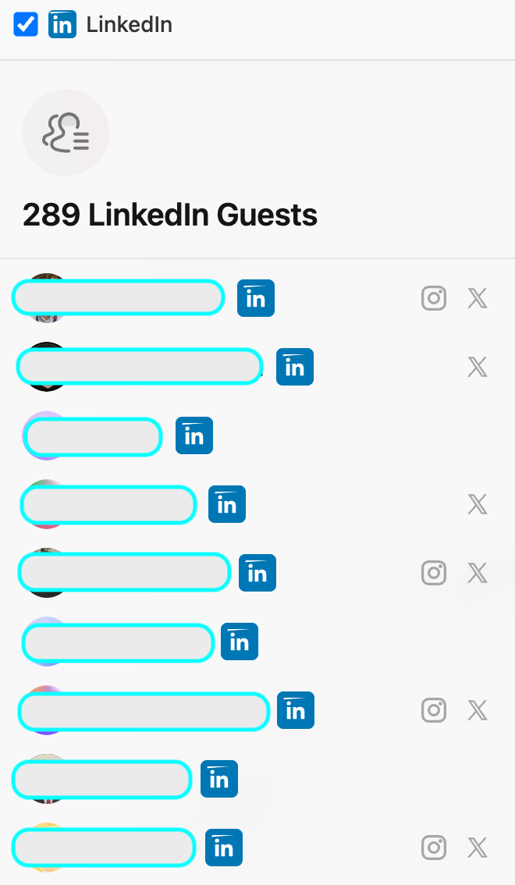

# Luma Guest List Enhancer

A browser userscript that adds LinkedIn profile links right into the Guest List. Created in a couple of hours of vibe codding.

## Installation

### Step 1: Install Tampermonkey

Tampermonkey is a browser extension that allows you to run userscripts. Install it for your browser:

- **Chrome**: [Install from Chrome Web Store](https://chrome.google.com/webstore/detail/tampermonkey/dhdgffkkebhmkfjojejmpbldmpobfkfo)
- **Safari**: [Install from App Store](https://apps.apple.com/us/app/tampermonkey/id6738342400)

### Step 2: Install the Script

- Click the Tampermonkey icon in your browser
- Select "Create a new script..."
- Delete the default content
- Copy and paste the entire contents of [`luma.user.js`](luma.user.js)
- Press `Ctrl+S` (or `Cmd+S` on Mac) to save

## Usage

1. **Navigate to a Luma Event**: Go to any event page on lu.ma
2. **Open Guest List**: Click on the guest count button (e.g., "42 Guests") to open the guest list popup
3. **View Enhanced List**:
   - LinkedIn icons will appear next to guests who have LinkedIn profiles
   - Click any LinkedIn icon to open that person's profile in a new tab
4. **Filter by LinkedIn**: Check the "LinkedIn" filter checkbox to show only guests with LinkedIn profiles

## License

This project is licensed under the MIT License - see the [LICENSE](LICENSE) file for details.

## Disclaimer

This userscript is for educational and productivity purposes.
